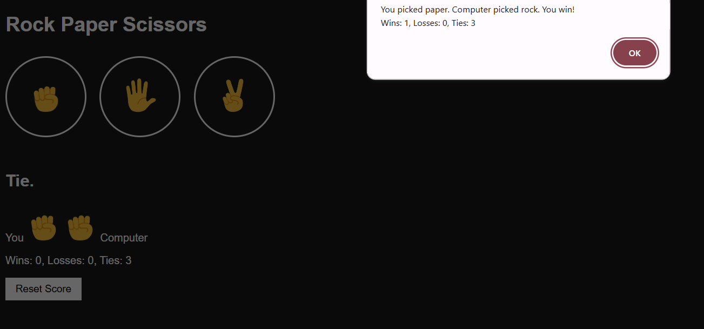

# Rock-Paper-Scissors Game

A simple **Rock-Paper-Scissors** game built using **HTML, CSS, and JavaScript**. Test your luck and strategy against the computer in this interactive browser game!

## File Structure
- `10-rock-paper-sci.html` – The main HTML file to launch the game.  
- `styles/10-rock-paper-sci.css` – Contains all the styling for the game.  
- `scripts/10-rock-paper-sci.js` – Handles game logic and user interactions.  
- `images/` – Contains all the images used for Rock, Paper, and Scissors.

## Screenshot

  

## How to Play

1. Open  html  in your browser.  
2. Click on **Rock**, **Paper**, or **Scissors** to make your move.  
3. The computer will randomly select its move.  
4. The winner will be displayed after each round.  

## Features

- Interactive gameplay with instant results.  
- Score tracking for player and computer.  
- Styled interface with custom images.  

## Technologies Used

- **HTML5** – Structure of the game.  
- **CSS3** – Styling and layout.  
- **JavaScript** – Game logic and interactivity.  

## Future Improvements

- Add animations for moves.  
- Play multiple rounds and track overall scores.  
- Responsive design for mobile devices.  

